<div align="center">

# 🚀 NexOps Enterprise Cloud Security Platform

### Production-style AWS Cloud Security infrastructure provisioned and managed entirely with Terraform

A security-focused AWS infrastructure project implementing **network security, centralized logging, configuration monitoring, encryption, alerting, and security auditing** using native AWS services and Infrastructure as Code.

[](https://www.terraform.io/)

[](https://aws.amazon.com/)

[](https://aws.amazon.com/cloudtrail/)

[](https://aws.amazon.com/config/)

[](https://aws.amazon.com/cloudwatch/)

[](https://aws.amazon.com/s3/)

[](https://aws.amazon.com/sns/)

[](https://aws.amazon.com/kms/)

[](https://aws.amazon.com/vpc/)

</div>

---

## 📋 Table of Contents

* [Project Overview](#-project-overview)
* [Security Architecture](#-security-architecture)
* [Tech Stack](#-tech-stack)
* [Project Structure](#-project-structure)
* [Prerequisites](#-prerequisites)
* [Step-by-Step Deployment](#-step-by-step-deployment)
* [Terraform Plan](#-terraform-plan)
* [Terraform Outputs](#-terraform-outputs)
* [Verify Infrastructure](#-verify-infrastructure)
* [CloudTrail](#-cloudtrail)
* [VPC Flow Logs](#-vpc-flow-logs)
* [AWS Config](#-aws-config)
* [CloudWatch Monitoring](#-cloudwatch-monitoring)
* [KMS Encryption](#-kms-encryption)
* [S3 Security Logging](#-s3-security-logging)
* [SNS Alerting](#-sns-alerting)
* [Security Hub and GuardDuty](#-security-hub-and-guardduty)
* [Cost Verification](#-cost-verification)
* [Troubleshooting](#-troubleshooting)
* [Tear Down](#-tear-down)
* [Documentation](#-documentation)
* [What This Demonstrates](#-what-this-demonstrates)

---

## 📋 Project Overview

**NexOps Enterprise Cloud Security Platform** is a Terraform-based AWS security infrastructure project designed to demonstrate how cloud security controls can be provisioned, monitored, and verified using Infrastructure as Code.

The platform establishes a dedicated AWS VPC and implements multiple security and monitoring layers:

* **VPC network isolation**
* **Public and private subnets across multiple Availability Zones**
* **VPC Flow Logs**
* **AWS CloudTrail**
* **AWS Config**
* **CloudWatch logging and monitoring**
* **CloudWatch metric alarms**
* **SNS security alerting**
* **AWS KMS encryption**
* **Encrypted and versioned S3 security storage**
* **IAM roles and policies**
* **Security event processing through EventBridge**

The infrastructure is designed as a **security foundation** that can be attached to or used alongside an application infrastructure project.

---

## 🛡 Security Architecture

The platform follows a layered cloud-security architecture.

```text
                         AWS ACCOUNT
                              │
                              ▼
                    ┌───────────────────┐
                    │   IAM / Security  │
                    │   Policies/Roles  │
                    └─────────┬─────────┘
                              │
                              ▼
                    ┌───────────────────┐
                    │       VPC         │
                    │    10.60.0.0/16   │
                    └─────────┬─────────┘
                              │
             ┌────────────────┴────────────────┐
             │                                 │
             ▼                                 ▼
     ┌───────────────┐                 ┌───────────────┐
     │ Public         │                 │ Private       │
     │ Subnets        │                 │ Subnets      │
     │                │                 │               │
     │ AZ-1 / AZ-2    │                 │ AZ-1 / AZ-2   │
     └───────┬────────┘                 └───────────────┘
             │
             │
             ▼
      ┌───────────────┐
      │ VPC Flow Logs │
      └───────┬───────┘
              │
              ▼
      ┌────────────────┐
      │   CloudWatch   │
      │    Log Group   │
      └────────────────┘


      AWS ACCOUNT ACTIVITY
              │
              ▼
       ┌──────────────┐
       │  CloudTrail  │
       └──────┬───────┘
              │
              ├──────────────► S3
              │
              └──────────────► CloudWatch


       RESOURCE CONFIGURATION
              │
              ▼
       ┌──────────────┐
       │ AWS Config   │
       └──────┬───────┘
              │
              ▼
       Configuration
        Monitoring


       SECURITY EVENTS
              │
              ▼
       ┌──────────────┐
       │ EventBridge  │
       └──────┬───────┘
              │
              ▼
       ┌──────────────┐
       │     SNS      │
       │   Alerts     │
       └──────────────┘


       ENCRYPTION
              │
              ▼
       ┌──────────────┐
       │   AWS KMS    │
       │ Customer Key │
       └──────────────┘
```

### VPC and Subnet Layout

The Terraform deployment created the security VPC:

```text
VPC
10.60.0.0/16

├── Public Subnet AZ-1
├── Public Subnet AZ-2
├── Private Subnet AZ-1
└── Private Subnet AZ-2
```

<p align="center">
  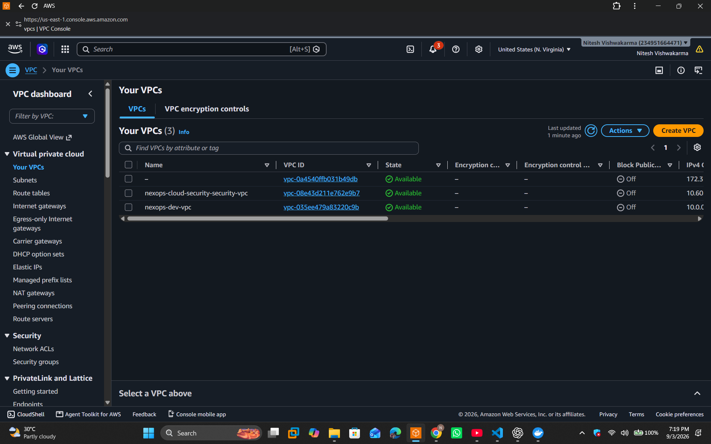
</p>

The subnet layout can also be viewed in the AWS console:

<p align="center">
  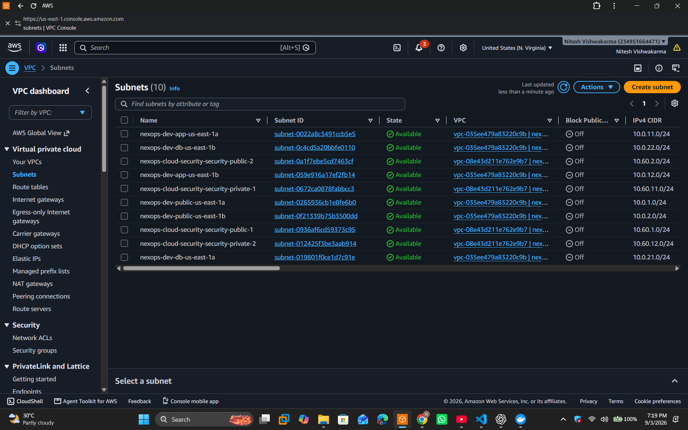
</p>

---

## 🛠 Tech Stack

| Layer                        | Technology                            |
| ---------------------------- | ------------------------------------- |
| **Infrastructure as Code**   | Terraform                             |
| **Cloud Platform**           | Amazon Web Services                   |
| **Networking**               | AWS VPC                               |
| **Subnets**                  | Public + Private Subnets across 2 AZs |
| **Network Logging**          | VPC Flow Logs                         |
| **Audit Logging**            | AWS CloudTrail                        |
| **Configuration Monitoring** | AWS Config                            |
| **Monitoring**               | Amazon CloudWatch                     |
| **Alerting**                 | Amazon SNS                            |
| **Event Processing**         | Amazon EventBridge                    |
| **Encryption**               | AWS KMS                               |
| **Security Storage**         | Amazon S3                             |
| **Identity & Access**        | AWS IAM                               |
| **CLI**                      | AWS CLI                               |
| **Automation**               | Terraform                             |

---

## 📁 Project Structure

```text
enterprise-aws-cloud-security-platform/
│
├── terraform/
│   ├── provider.tf
│   ├── variables.tf
│   ├── outputs.tf
│   ├── versions.tf
│   │
│   ├── vpc.tf
│   ├── security_groups.tf
│   ├── iam.tf
│   ├── cloudtrail.tf
│   ├── config.tf
│   ├── flow_logs.tf
│   ├── cloudwatch.tf
│   ├── sns.tf
│   ├── kms.tf
│   ├── s3.tf
│   ├── eventbridge.tf
│   └── ...
│
├── screenshots/
│   ├── 01-terraform-plan.png
│   ├── 02-terraform-output'.png
│   ├── 03-terraform-state-list.png
│   ├── 04-vpc.png
│   ├── 05-CloudTrial.png
│   ├── 06-vpc-flow-logs.png
│   ├── 07-aws-config.png
│   ├── 08-cloudwatch.png
│   ├── 09-kms.png
│   ├── CloudTrial.png
│   ├── cloudwatch.png
│   ├── S3.png
│   ├── SNS.png
│   ├── VPC-subnet.png
│   └── VPC.png
│
├── docs/
│   ├── DEPLOYMENT_GUIDE.md
│   ├── SECURITY_ARCHITECTURE.md
│   ├── TROUBLESHOOTING.md
│   └── INTERVIEW_QA.md
│
├── diagrams/
│   └── architecture.md
│
└── README.md
```

---

# 🔐 Prerequisites

Before deploying the project, install and configure:

### Terraform

Verify Terraform:

```bash
terraform version
```

Expected:

```text
Terraform v1.6+
```

### AWS CLI

Verify authentication:

```bash
aws sts get-caller-identity
```

Example:

```text
{
    "UserId": "...",
    "Account": "234951664471",
    "Arn": "arn:aws:iam::234951664471:user/cloudwithnitesh"
}
```

The AWS credentials must have permission to create the required networking, logging, IAM, encryption, monitoring, and security resources.

---

# 🚀 Step-by-Step Deployment

## 1. Clone the Repository

```bash
git clone <YOUR_GITHUB_REPOSITORY_URL>
cd enterprise-aws-cloud-security-platform
```

Then:

```bash
cd terraform
```

---

## 2. Authenticate with AWS

Confirm that the AWS CLI is using the intended account:

```bash
aws sts get-caller-identity
```

This should return the AWS account and IAM identity that will own the infrastructure.

---

## 3. Initialize Terraform

```bash
terraform init
```

Terraform downloads the required providers and initializes the working directory.

---

## 4. Validate Terraform Configuration

```bash
terraform validate
```

Expected:

```text
Success! The configuration is valid.
```

---

# 📋 Terraform Plan

Before creating resources, generate the execution plan:

```bash
terraform plan
```

<p align="center">
  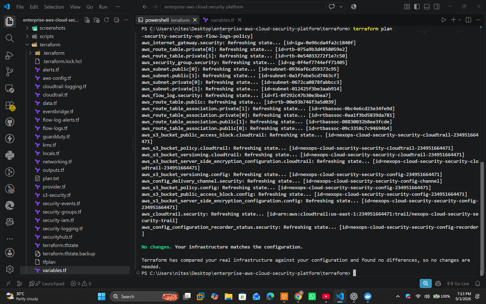
</p>

The plan provides a preview of the infrastructure Terraform intends to create.

It is an important Infrastructure-as-Code security practice because changes can be reviewed before they are applied.

---

# 🚀 Apply the Infrastructure

Run:

```bash
terraform apply
```

Review the proposed resources and type:

```text
yes
```

Terraform then provisions the AWS security infrastructure.

---

# 📤 Terraform Outputs

After deployment:

```bash
terraform output
```

<p align="center">
  
</p>

Important outputs include:

```text
aws_account_id
aws_region
project_name
vpc_id
public_subnet_ids
private_subnet_ids
cloudtrail_name
cloudtrail_bucket
config_bucket
config_recorder_name
security_log_group
security_alert_topic_arn
kms_alias
kms_key_arn
vpc_flow_log_id
```

These outputs provide the identifiers required to verify the deployed environment.

---

# 🗂 Terraform State

Verify the resources currently managed by Terraform:

```bash
terraform state list
```

<p align="center">
  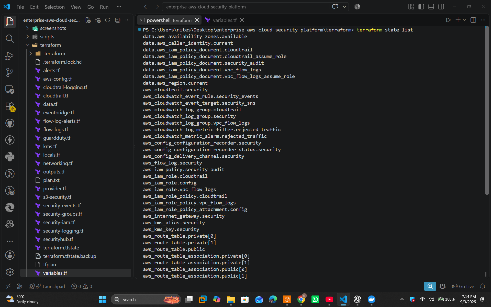
</p>

The state demonstrates that Terraform is managing the infrastructure rather than the resources being created manually through the AWS console.

---

# 🔍 Verify Infrastructure

## Verify the VPC

Run:

```bash
aws ec2 describe-vpcs --region us-east-1 \
  --filters "Name=tag:Project,Values=nexops-cloud-security" \
  --query "Vpcs[*].[VpcId,State,CidrBlock]" \
  --output table
```

Example:

```text
--------------------------------------------------------
|                     DescribeVpcs                     |
+------------------------+------------+----------------+
|  vpc-08e43d211e762e9b7 |  available |  10.60.0.0/16  |
+------------------------+------------+----------------+
```

<p align="center">
  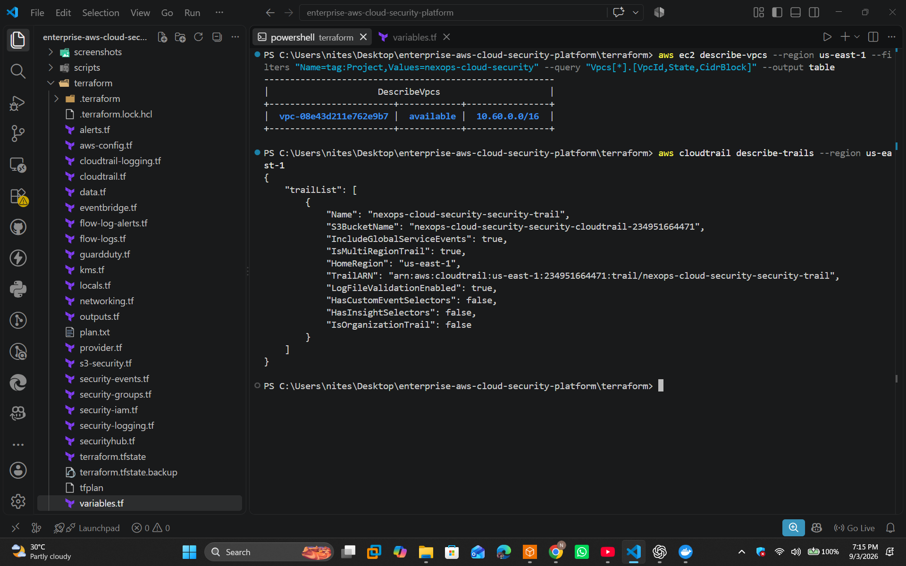
</p>

The VPC is confirmed as:

```text
State: available
CIDR: 10.60.0.0/16
```

---

# 📜 CloudTrail

AWS CloudTrail provides account-level API activity auditing.

The project creates a multi-region CloudTrail trail with:

* Multi-region logging
* Global service events
* Log file validation
* S3 log storage
* CloudWatch integration

Verify the trail:

```bash
aws cloudtrail describe-trails
```

<p align="center">
  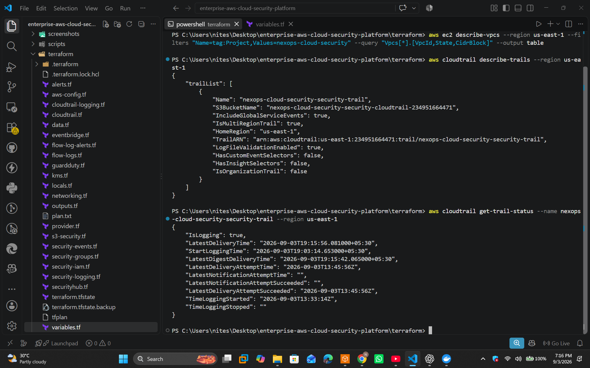
</p>

Check whether CloudTrail is actively logging:

```bash
aws cloudtrail get-trail-status \
  --name nexops-cloud-security-security-trail \
  --region us-east-1
```

Example successful status:

```text
"IsLogging": true
```

The actual AWS console configuration can also be verified:

<p align="center">
  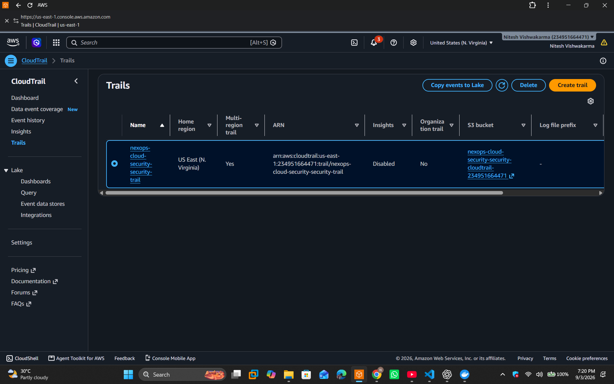
</p>

CloudTrail is one of the primary audit controls in the platform.

---

# 🌐 VPC Flow Logs

VPC Flow Logs capture network traffic metadata for the security VPC.

Verify the flow log:

```bash
aws ec2 describe-flow-logs \
  --region us-east-1 \
  --filter "Name=resource-id,Values=vpc-08e43d211e762e9b7" \
  --query "FlowLogs[*].[FlowLogId,FlowLogStatus,TrafficType,LogDestination]" \
  --output table
```

Example:

```text
| FlowLogId             | ACTIVE | ALL | CloudWatch Log Group |
```

<p align="center">
  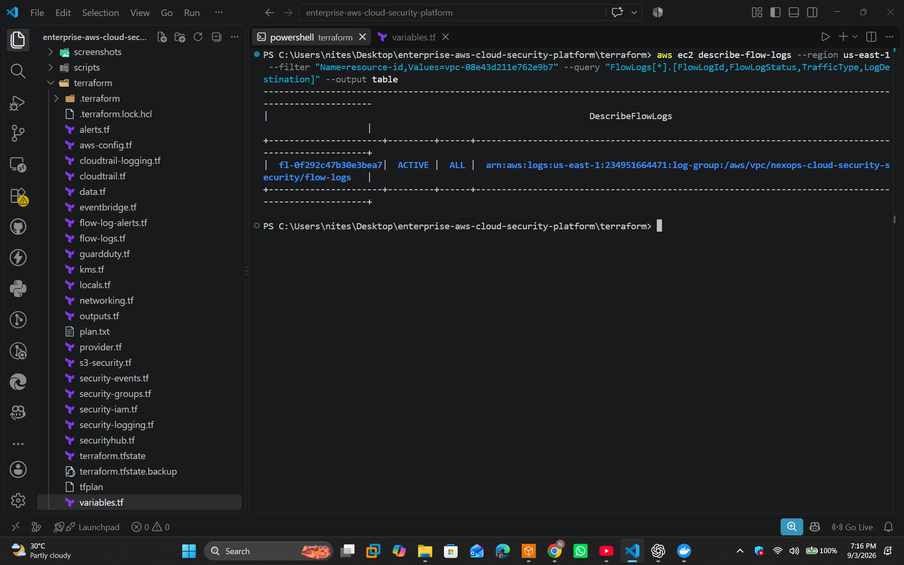
</p>

The configured flow log captures:

```text
Traffic Type: ALL
Status: ACTIVE
Destination: CloudWatch Logs
```

This provides visibility into network-level activity within the VPC.

---

# ⚙️ AWS Config

AWS Config continuously records configuration information for supported AWS resources.

Verify the configuration recorder:

```bash
aws configservice describe-configuration-recorders
```

<p align="center">
  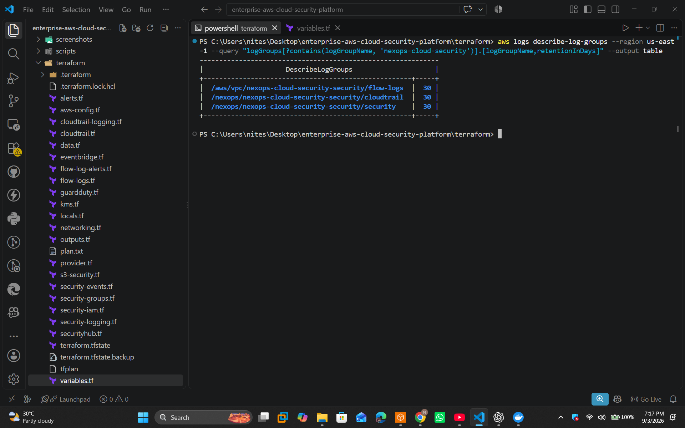
</p>

Verify the recorder status:

```bash
aws configservice describe-configuration-recorder-status \
  --region us-east-1
```

A successful deployment should show:

```text
"recording": true
"lastStatus": "SUCCESS"
```

This allows the environment to maintain a historical view of resource configuration.

---

# 📊 CloudWatch Monitoring

CloudWatch is used as the centralized monitoring and logging layer.

The project creates security-related CloudWatch log groups and monitoring components.

Verify the security log groups:

```bash
aws logs describe-log-groups \
  --region us-east-1 \
  --query "logGroups[?contains(logGroupName, 'nexops-cloud-security')].[logGroupName,retentionInDays]" \
  --output table
```

Example configured groups:

```text
/aws/vpc/nexops-cloud-security-security/flow-logs
/nexops/nexops-cloud-security-security/cloudtrail
/nexops/nexops-cloud-security-security/security
```

<p align="center">
  
</p>

The AWS console configuration can also be inspected:

<p align="center">
  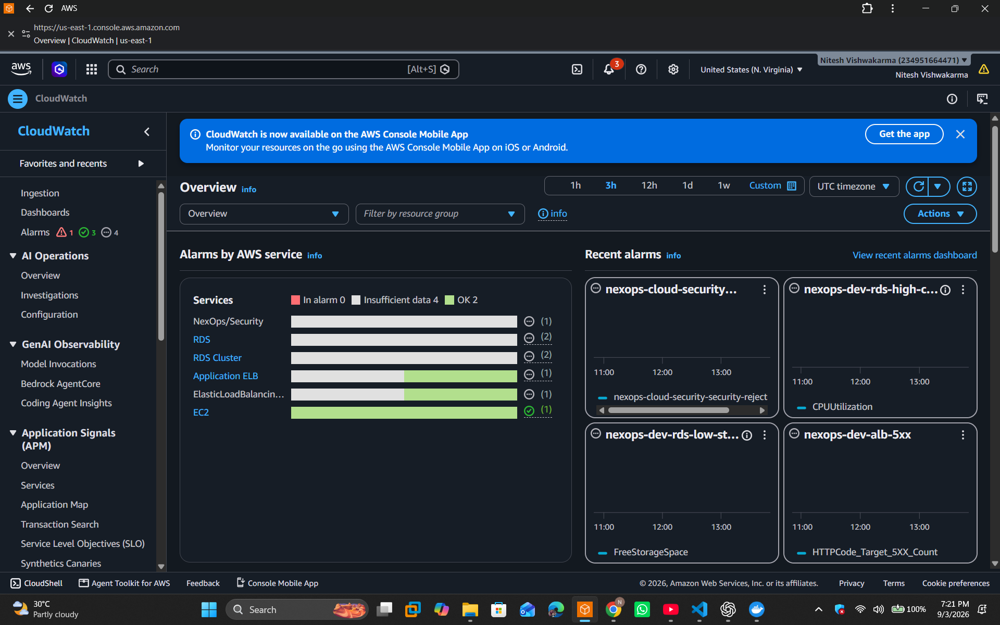
</p>

CloudWatch provides the central visibility layer for security and infrastructure events.

---

# 🔐 AWS KMS

AWS KMS provides encryption-key management for protected resources.

The project provisions a customer-managed KMS key and alias.

Verify the Terraform output:

```bash
terraform output kms_alias
terraform output kms_key_arn
```

Example:

```text
kms_alias = "alias/nexops-cloud-security-security"

kms_key_arn = "arn:aws:kms:us-east-1:..."
```

<p align="center">
  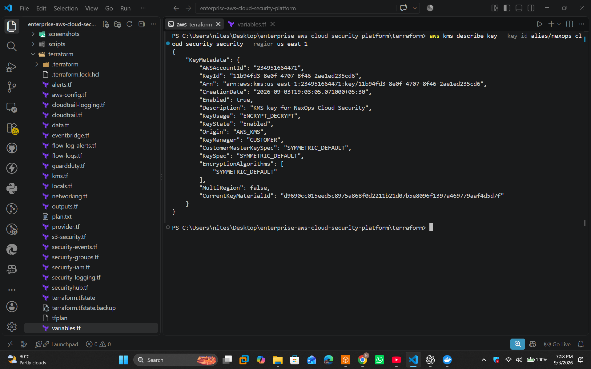
</p>

The KMS key is used as part of the security architecture for encryption.

---

# 🪣 S3 Security Storage

Amazon S3 is used for security-related log storage.

The CloudTrail bucket is configured as a private bucket with security controls such as:

* Public access blocking
* Server-side encryption
* Versioning
* CloudTrail bucket policy

The deployed infrastructure includes:

```text
nexops-cloud-security-security-cloudtrail-<ACCOUNT_ID>
```

AWS console verification:

<p align="center">
  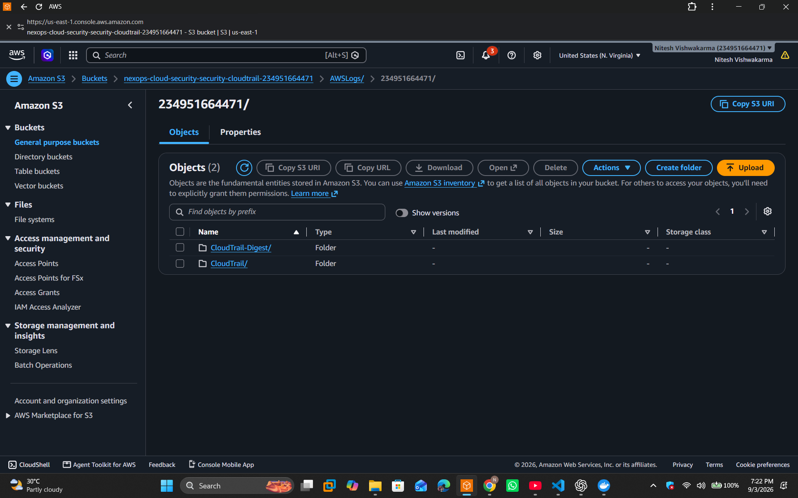
</p>

The S3 bucket provides durable storage for CloudTrail security logs.

---

# 🔔 SNS Alerting

Amazon SNS provides the notification layer for security events.

Terraform creates the security alert topic:

```text
nexops-cloud-security-security-alerts
```

The topic ARN is available through:

```bash
terraform output security_alert_topic_arn
```

AWS console verification:

<p align="center">
  
</p>

The architecture allows security events to flow through EventBridge and SNS for notification.

### Important

The deployment showed:

```text
SubscriptionsConfirmed = 0
```

This means no confirmed SNS email subscription was present at the time of verification.

The infrastructure itself is deployed, but an email notification will only be delivered after a subscription is created and confirmed.

---

# 🛡 Security Hub and GuardDuty

This project includes Terraform integration points for AWS security services, but **AWS Security Hub and GuardDuty were not successfully enabled in the deployment account**.

The AWS API returned:

```text
SubscriptionRequiredException:
The AWS Access Key Id needs a subscription for the service
```

For example:

```bash
aws securityhub describe-hub --region us-east-1
```

returned the subscription error.

Likewise:

```bash
aws guardduty list-detectors --region us-east-1
```

returned the same service-subscription error.

Therefore the final Terraform outputs correctly reported:

```text
securityhub_status = "disabled"
guardduty_status   = "disabled"
```

### Why this is documented

This README intentionally does **not** claim that Security Hub or GuardDuty were successfully enabled.

The project demonstrates the Terraform integration and the real-world handling of an AWS service availability/subscription limitation.

This is also documented as part of the project's troubleshooting and deployment evidence.

---

# 💰 Cost Verification

Because AWS security services and infrastructure can generate charges, cost verification was performed before teardown.

AWS Cost Explorer can be queried using:

```bash
aws ce get-cost-and-usage `
  --time-period Start=2026-09-01,End=2026-09-04 `
  --granularity DAILY `
  --metrics UnblendedCost `
  --region us-east-1 `
  --output table
```

When grouping costs by AWS service, the correct syntax is:

```bash
--group-by Type=DIMENSION,Key=SERVICE
```

For example:

```bash
aws ce get-cost-and-usage `
  --time-period Start=2026-09-01,End=2026-09-04 `
  --granularity DAILY `
  --metrics UnblendedCost `
  --group-by Type=DIMENSION,Key=SERVICE `
  --region us-east-1 `
  --output table
```

Cost data may initially appear as **Estimated** and can change as AWS finalizes billing data.

---

# 🧪 Final Verification Before Teardown

Before destroying the environment, the following security controls were verified:

### AWS Identity

```bash
aws sts get-caller-identity
```

### VPC

```bash
aws ec2 describe-vpcs
```

### CloudTrail

```bash
aws cloudtrail describe-trails
```

```bash
aws cloudtrail get-trail-status \
  --name nexops-cloud-security-security-trail \
  --region us-east-1
```

Expected:

```text
IsLogging = true
```

### VPC Flow Logs

```bash
aws ec2 describe-flow-logs
```

Expected:

```text
FlowLogStatus = ACTIVE
TrafficType = ALL
```

### AWS Config

```bash
aws configservice describe-configuration-recorder-status \
  --region us-east-1
```

Expected:

```text
recording = true
lastStatus = SUCCESS
```

### CloudWatch

```bash
aws logs describe-log-groups --region us-east-1
```

### Terraform State

```bash
terraform state list
```

### Terraform Outputs

```bash
terraform output
```

These checks provided evidence that the security platform was successfully provisioned before teardown.

---

# 🩹 Troubleshooting

## `SubscriptionRequiredException` from Security Hub

Error:

```text
SubscriptionRequiredException:
The AWS Access Key Id needs a subscription for the service
```

This means the AWS account/API identity cannot use the requested Security Hub service through the current subscription/availability state.

Verify the AWS identity:

```bash
aws sts get-caller-identity
```

Then test:

```bash
aws securityhub describe-hub --region us-east-1
```

Do not repeatedly run Terraform expecting the same service call to succeed.

The project records Security Hub as:

```text
securityhub_status = disabled
```

---

## `SubscriptionRequiredException` from GuardDuty

Test:

```bash
aws guardduty list-detectors --region us-east-1
```

If AWS returns:

```text
SubscriptionRequiredException
```

the service is unavailable for the current account/API subscription state.

The project therefore records:

```text
guardduty_status = disabled
```

---

## Cost Explorer `Group Definition is invalid`

Incorrect:

```bash
--group-by Type=SERVICE
```

Correct:

```bash
--group-by Type=DIMENSION,Key=SERVICE
```

AWS Cost Explorer requires both the group definition type and key.

---

## Terraform State Lock

If Terraform reports a state lock:

```text
Error acquiring the state lock
```

Inspect the lock information first.

If the lock is confirmed stale:

```bash
terraform force-unlock <LOCK_ID>
```

Do not force-unlock a state currently being used by another Terraform process.

---

## AWS CLI Authentication

If AWS commands fail unexpectedly, verify:

```bash
aws sts get-caller-identity
```

If the returned account is not the intended account, stop before running:

```bash
terraform apply
```

or:

```bash
terraform destroy
```

---

# 🧹 Tear Down

This project was intentionally destroyed after verification to avoid unnecessary AWS charges.

From the Terraform directory:

```bash
terraform destroy
```

Review the resources Terraform plans to remove and type:

```text
yes
```

Terraform should remove the infrastructure it manages.

After destruction, verify the VPC no longer exists:

```bash
aws ec2 describe-vpcs \
  --region us-east-1 \
  --filters "Name=tag:Project,Values=nexops-cloud-security"
```

Also verify important resources such as CloudTrail, Flow Logs, Config, CloudWatch resources, SNS, S3, and KMS according to the project's teardown documentation.

### ⚠️ Important

Always verify the AWS account before running:

```bash
terraform destroy
```

using:

```bash
aws sts get-caller-identity
```

Terraform destruction is irreversible for the infrastructure resources being removed.

---

# 📚 Documentation

| Document                                                         | Description                                     |
| ---------------------------------------------------------------- | ----------------------------------------------- |
| [`docs/DEPLOYMENT_GUIDE.md`](docs/DEPLOYMENT_GUIDE.md)           | Complete deployment and teardown procedure      |
| [`docs/SECURITY_ARCHITECTURE.md`](docs/SECURITY_ARCHITECTURE.md) | Security architecture and AWS security controls |
| [`docs/TROUBLESHOOTING.md`](docs/TROUBLESHOOTING.md)             | Common deployment and AWS service issues        |
| [`docs/INTERVIEW_QA.md`](docs/INTERVIEW_QA.md)                   | Interview questions and project talking points  |
| [`diagrams/architecture.md`](diagrams/architecture.md)           | Architecture and network layout                 |

---

# 📸 Evidence / Screenshots

The repository includes both **terminal evidence** and **AWS Console evidence**.

### Terraform / CLI Evidence

```text
01-terraform-plan.png
02-terraform-output'.png
03-terraform-state-list.png
04-vpc.png
05-CloudTrial.png
06-vpc-flow-logs.png
07-aws-config.png
08-cloudwatch.png
09-kms.png
```

These screenshots demonstrate the actual commands and outputs used to verify the deployment.

### AWS Console Evidence

```text
CloudTrial.png
cloudwatch.png
S3.png
SNS.png
VPC-subnet.png
VPC.png
```

These screenshots demonstrate the corresponding resources in the AWS Management Console.

---

# 💡 What This Demonstrates

This project demonstrates practical knowledge of **AWS Cloud Security and Infrastructure as Code**, including:

* Infrastructure deployment using Terraform
* AWS VPC architecture
* Public/private subnet design
* Multi-AZ network architecture
* IAM roles and policies
* VPC Flow Logs
* AWS CloudTrail auditing
* AWS Config configuration monitoring
* CloudWatch centralized logging
* CloudWatch security monitoring
* SNS security notifications
* EventBridge security event routing
* AWS KMS key management
* S3 security log storage
* Encryption and data protection
* Infrastructure verification using AWS CLI
* Terraform state management
* AWS Cost Explorer usage
* Security-service troubleshooting
* Safe infrastructure teardown
* Evidence-based cloud security validation

Most importantly, this project demonstrates that the infrastructure was **actually provisioned, verified through AWS CLI and the AWS Console, documented with screenshots, and then destroyed to control cloud costs**.

---

# 🔗 Relationship With the NexOps Infrastructure Project

This project is designed as the **security layer** for the broader NexOps cloud infrastructure portfolio.

```text
                    NexOps Cloud Portfolio
                              │
              ┌───────────────┴────────────────┐
              │                                │
              ▼                                ▼
┌───────────────────────────┐    ┌───────────────────────────┐
│ Project 1                 │    │ Project 2                 │
│ Enterprise AWS            │    │ Enterprise AWS            │
│ Cloud Infrastructure      │    │ Cloud Security Platform   │
│                           │    │                           │
│ Terraform                 │    │ Terraform                 │
│ VPC                       │    │ CloudTrail                │
│ ALB                       │    │ AWS Config                │
│ EC2 / ASG                 │    │ VPC Flow Logs             │
│ RDS                       │    │ CloudWatch                │
│ S3                        │    │ SNS                       │
│ Route 53                  │    │ KMS                       │
│ ACM                       │    │ EventBridge               │
└──────────────┬────────────┘    └──────────────┬────────────┘
               │                                │
               └───────────────┬────────────────┘
                               ▼
                  Enterprise Cloud Environment
```

Project 1 focuses primarily on **application infrastructure and availability**.

Project 2 focuses primarily on **security, auditing, monitoring, encryption, and threat visibility**.

Together they demonstrate how cloud infrastructure and cloud security controls can be designed as complementary layers.

---

<div align="center">

## 🚀 Built by Nitesh

**NexOps Enterprise Cloud Security Platform**

*AWS Cloud Security • Terraform • Infrastructure as Code*

</div>
