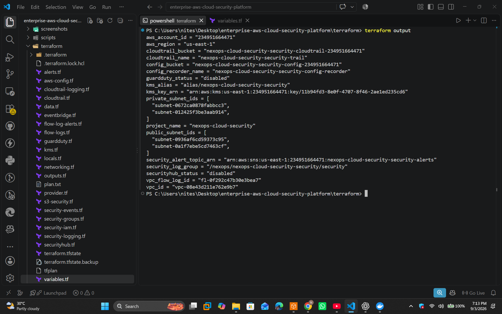

# Deployment Guide — Enterprise AWS Cloud Security Platform

## 1. Overview

This document explains how to deploy, verify, operate, and safely destroy the **NexOps Enterprise AWS Cloud Security Platform**.

The platform is provisioned using **Terraform** and provides a security-focused AWS foundation containing:

* Amazon VPC
* Public and private subnets across multiple Availability Zones
* VPC Flow Logs
* AWS CloudTrail
* AWS Config
* Amazon CloudWatch
* Amazon S3
* AWS KMS
* Amazon SNS
* Amazon EventBridge
* IAM roles and policies
* CloudWatch metric filters and alarms

The infrastructure is designed as a production-style cloud-security laboratory and portfolio project.

---

## 2. Architecture Overview

The platform follows a layered security architecture:

```text
                         AWS ACCOUNT
                              |
                              v
                    +-------------------+
                    |       VPC         |
                    |    10.60.0.0/16   |
                    +---------+---------+
                              |
              +---------------+---------------+
              |                               |
              v                               v
       Public Subnets                  Private Subnets
       AZ-1 / AZ-2                    AZ-1 / AZ-2
              |                               |
              +---------------+---------------+
                              |
                              v
                       VPC Flow Logs
                              |
                              v
                     CloudWatch Logs
                              |
          +-------------------+-------------------+
          |                   |                   |
          v                   v                   v
      CloudTrail         AWS Config          CloudWatch
          |                   |                   |
          v                   v                   v
         S3                 S3             Alarms / Metrics
          |                                       |
          +-------------------+-------------------+
                              |
                              v
                         EventBridge
                              |
                              v
                             SNS
```

---

## 3. Prerequisites

Install and configure:

* Terraform >= 1.6
* AWS CLI v2
* Git
* An AWS account
* IAM credentials with the permissions required by the Terraform configuration

Verify AWS authentication:

```powershell
aws sts get-caller-identity
```

Expected output contains the AWS account and IAM identity.

Example:

```text
Account: 234951664471
Arn: arn:aws:iam::234951664471:user/cloudwithnitesh
```

Verify Terraform:

```powershell
terraform version
```

---

## 4. Clone the Repository

```powershell
git clone https://github.com/NiteshVishwakarma219/enterprise-aws-cloud-security-platform.git
cd enterprise-aws-cloud-security-platform
```

Move into Terraform:

```powershell
cd terraform
```

---

## 5. Configure AWS Credentials

Verify the active AWS identity:

```powershell
aws sts get-caller-identity
```

Verify the target region:

```powershell
aws configure get region
```

The project was tested in:

```text
us-east-1
```

---

## 6. Initialize Terraform

Run:

```powershell
terraform init
```

Terraform downloads the required providers locally into:

```text
.terraform/
```

This directory is intentionally excluded from Git.

The provider binaries must never be committed to the repository.

---

## 7. Validate the Configuration

Run:

```powershell
terraform validate
```

Expected result:

```text
Success! The configuration is valid.
```

Format the Terraform configuration if required:

```powershell
terraform fmt -recursive
```

---

## 8. Review the Deployment Plan

Run:

```powershell
terraform plan
```

Review the resources before approving the deployment.

The plan should contain the expected networking, logging, monitoring, encryption, storage, IAM and security resources.


---

## 9. Deploy the Infrastructure

Run:

```powershell
terraform apply
```

Review the plan and enter:

```text
yes
```

Terraform creates the AWS infrastructure.

---

## 10. Review Terraform Outputs

After deployment:

```powershell
terraform output
```

The verified deployment produced outputs including:

```text
aws_account_id
aws_region
cloudtrail_bucket
cloudtrail_name
config_bucket
config_recorder_name
guardduty_status
kms_alias
kms_key_arn
private_subnet_ids
project_name
public_subnet_ids
security_alert_topic_arn
security_log_group
securityhub_status
vpc_flow_log_id
vpc_id
```



---

## 11. Review Terraform State

Run:

```powershell
terraform state list
```

This confirms the infrastructure managed by Terraform.


Terraform state contains infrastructure metadata and should not be committed to a public repository.

---

# 12. Verify the VPC

Run:

```powershell
aws ec2 describe-vpcs `
  --region us-east-1 `
  --filters "Name=tag:Project,Values=nexops-cloud-security" `
  --query "Vpcs[*].[VpcId,State,CidrBlock]" `
  --output table
```

The verified VPC was:

```text
VPC ID: vpc-08e43d211e762e9b7
CIDR:   10.60.0.0/16
State:  available
```


---

# 13. Verify CloudTrail

List the configured trails:

```powershell
aws cloudtrail describe-trails --region us-east-1
```

Verify logging:

```powershell
aws cloudtrail get-trail-status `
  --name nexops-cloud-security-security-trail `
  --region us-east-1
```

The verified result showed:

```text
IsLogging: true
```

CloudTrail was configured as a multi-region trail and delivered logs to S3.


---

# 14. Verify VPC Flow Logs

Run:

```powershell
aws ec2 describe-flow-logs `
  --region us-east-1 `
  --filter "Name=resource-id,Values=vpc-08e43d211e762e9b7" `
  --query "FlowLogs[*].[FlowLogId,FlowLogStatus,TrafficType,LogDestination]" `
  --output table
```

Verified result:

```text
FlowLogStatus: ACTIVE
TrafficType:   ALL
```

The logs are delivered to CloudWatch Logs.


---

# 15. Verify AWS Config

List configuration recorders:

```powershell
aws configservice describe-configuration-recorders `
  --region us-east-1
```

Verify recorder status:

```powershell
aws configservice describe-configuration-recorder-status `
  --region us-east-1
```

Verified result:

```text
recording: true
lastStatus: SUCCESS
```


---

# 16. Verify CloudWatch

List security-related log groups:

```powershell
aws logs describe-log-groups `
  --region us-east-1 `
  --query "logGroups[?contains(logGroupName, 'nexops-cloud-security')].[logGroupName,retentionInDays]" `
  --output table
```

Verified log groups included:

```text
/aws/vpc/nexops-cloud-security-security/flow-logs
/nexops/nexops-cloud-security-security/cloudtrail
/nexops/nexops-cloud-security-security/security
```

Retention was configured for 30 days.


---

# 17. Verify KMS

The infrastructure created a customer-managed KMS key and alias.

Terraform output:

```text
kms_alias = alias/nexops-cloud-security-security
```

The key ARN was also returned by Terraform.


---

# 18. Verify S3

The platform uses private S3 buckets for security-related data.

Verify buckets:

```powershell
aws s3api list-buckets `
  --query "Buckets[?contains(Name, 'nexops-cloud-security')].Name"
```

Security buckets are configured with:

* Public access blocking
* Server-side encryption
* Versioning where configured
* CloudTrail/security log storage


---

# 19. Verify SNS

The platform creates an SNS topic for security alerts.

Terraform output:

```text
security_alert_topic_arn
```

Verify:

```powershell
aws sns get-topic-attributes `
  --topic-arn <TOPIC_ARN>
```

The verified deployment showed:

```text
SubscriptionsConfirmed: 0
```

This means the SNS topic exists, but no email subscription had been confirmed.


---

# 20. Security Hub and GuardDuty

During deployment, AWS returned:

```text
SubscriptionRequiredException
```

for Security Hub and GuardDuty operations.

Therefore the final infrastructure correctly reports:

```text
securityhub_status = disabled
guardduty_status   = disabled
```

These services were not falsely represented as enabled.

This is an AWS account/service-subscription limitation rather than a Terraform syntax problem.

---

# 21. Final Verification

Useful commands:

```powershell
aws sts get-caller-identity
```

```powershell
aws cloudtrail get-trail-status `
  --name nexops-cloud-security-security-trail `
  --region us-east-1
```

```powershell
aws ec2 describe-flow-logs `
  --region us-east-1 `
  --filter "Name=resource-id,Values=vpc-08e43d211e762e9b7"
```

```powershell
aws configservice describe-configuration-recorder-status `
  --region us-east-1
```

```powershell
terraform output
```

```powershell
terraform state list
```

---

# 22. Destroy the Environment

This project contains AWS services that can incur charges.

When testing is complete:

```powershell
terraform destroy
```

Review the destruction plan and enter:

```text
yes
```

Verify the resources have been removed.

For example:

```powershell
terraform state list
```

should contain no managed infrastructure resources after a successful destroy.

---

# 23. Important Cost-Safety Rule

Do not leave paid AWS security infrastructure running unnecessarily.

In particular, continuously monitor services such as:

* AWS Config
* CloudTrail data/log storage
* CloudWatch Logs
* NAT Gateway if present
* VPC Flow Logs
* KMS
* S3 storage

Always verify the AWS Billing/Cost Explorer console after testing.

---

# 24. Repository Safety

The following must remain excluded from Git:

```text
.terraform/
*.tfstate
*.tfstate.*
*.tfvars
*.tfvars.json
AWS credentials
private keys
```

The Terraform provider binaries inside `.terraform/` are downloaded dependencies and are not project source code.

---

## 25. Deployment Evidence

The `screenshots/` directory contains evidence captured during deployment and verification.

These screenshots demonstrate that the infrastructure was actually provisioned and inspected through both:

* Terraform/AWS CLI
* AWS Management Console

The project was subsequently destroyed to control AWS costs.

---

## 26. Result

The final result is a Terraform-managed AWS Cloud Security platform with centralized logging, configuration recording, network telemetry, encryption, alerting infrastructure and security-focused monitoring.
