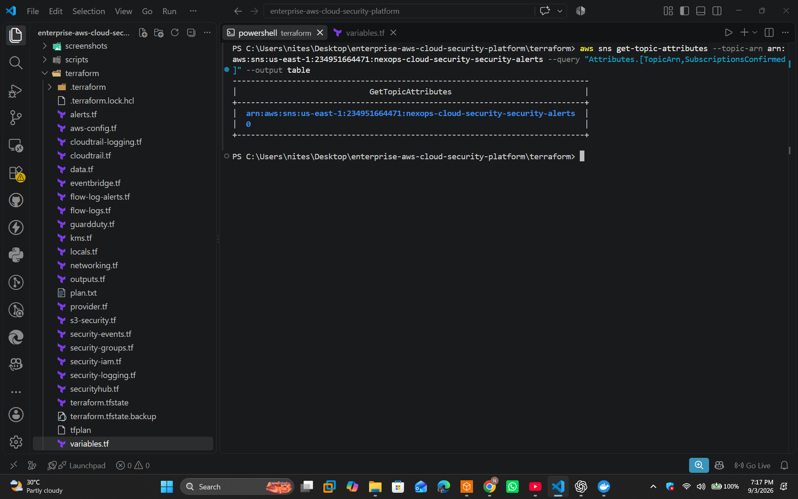
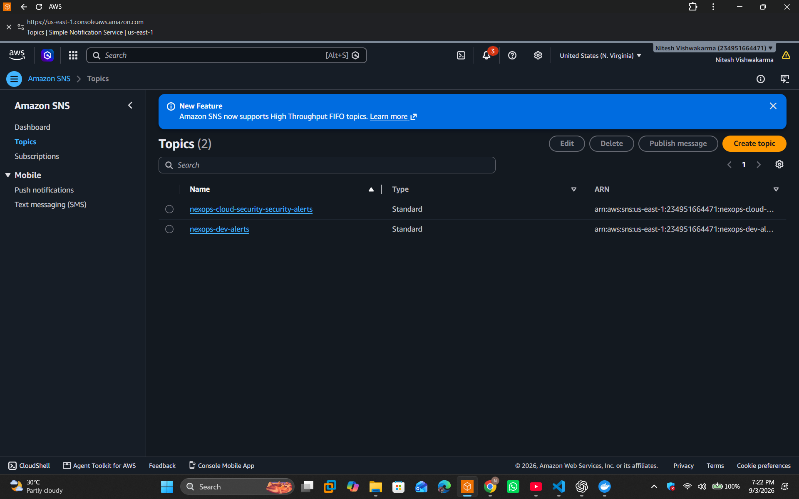

# Monitoring and Alerting — Enterprise AWS Cloud Security Platform

## 1. Overview

Monitoring is a core component of the Enterprise AWS Cloud Security Platform.

The platform combines:

* CloudWatch Logs
* CloudWatch Metrics
* CloudWatch Alarms
* VPC Flow Logs
* CloudTrail
* AWS Config
* EventBridge
* SNS

to provide visibility into infrastructure and security events.

---

# 2. Monitoring Architecture

```text
                    AWS RESOURCES
                         |
        +----------------+----------------+
        |                |                |
        v                v                v
   CloudTrail       VPC Flow Logs     AWS Config
        |                |                |
        v                v                v
       S3          CloudWatch Logs    Config Data
        |                |
        +--------+-------+
                 |
                 v
           CloudWatch
                 |
        +--------+---------+
        |                  |
        v                  v
      Metrics            Alarms
                           |
                           v
                       EventBridge
                           |
                           v
                          SNS
                           |
                           v
                     Notifications
```

---

# 3. CloudTrail Monitoring

CloudTrail records AWS API activity.

Verification:

```powershell
aws cloudtrail get-trail-status `
  --name nexops-cloud-security-security-trail `
  --region us-east-1
```

The final deployment showed:

```text
IsLogging: true
```

CloudTrail can be used to investigate:

* IAM changes
* Security group changes
* Resource creation
* Resource deletion
* Authentication-related API activity
* Configuration changes

---

# 4. VPC Flow Log Monitoring

VPC Flow Logs capture network traffic metadata.

Verification:

```powershell
aws ec2 describe-flow-logs `
  --region us-east-1 `
  --filter "Name=resource-id,Values=vpc-08e43d211e762e9b7"
```

Final status:

```text
ACTIVE
Traffic Type: ALL
```

The flow logs are delivered to CloudWatch Logs.

---

# 5. CloudWatch Log Groups

The deployed environment contained:

```text
/aws/vpc/nexops-cloud-security-security/flow-logs
/nexops/nexops-cloud-security-security/cloudtrail
/nexops/nexops-cloud-security-security/security
```

Retention:

```text
30 days
```

This limits uncontrolled log-storage growth.



---

# 6. CloudWatch Metric Filters

Metric filters can transform matching log entries into CloudWatch metrics.

For example, rejected network traffic can be counted.

Conceptually:

```text
Log Event
   |
   v
Metric Filter
   |
   v
CloudWatch Metric
   |
   v
Alarm
```

This allows security-relevant events to become measurable signals.

---

# 7. CloudWatch Alarms

The platform supports CloudWatch alarm-based monitoring.

An alarm can transition between:

```text
OK
 |
 v
ALARM
 |
 v
Notification
```

Typical security/operations conditions include:

* Increased rejected traffic
* Infrastructure health degradation
* Security event patterns
* Operational thresholds

---

# 8. EventBridge

EventBridge provides event routing.

Example:

```text
Security Event
      |
      v
EventBridge
      |
      v
Rule Match
      |
      v
SNS Target
```

This decouples event detection from notification.

---

# 9. SNS

The project creates:

```text
nexops-cloud-security-security-alerts
```

SNS is responsible for distributing alerts to configured subscribers.

Verification:

```powershell
aws sns get-topic-attributes `
  --topic-arn <TOPIC_ARN>
```

The final deployment reported:

```text
SubscriptionsConfirmed: 0
```

This means no SNS subscription was confirmed during final verification.



---

# 10. AWS Config Monitoring

AWS Config provides configuration monitoring.

Verification:

```powershell
aws configservice describe-configuration-recorder-status `
  --region us-east-1
```

Verified:

```text
recording: true
lastStatus: SUCCESS
```

Config helps identify configuration drift and resource changes.

---

# 11. Monitoring Retention

The project uses 30-day CloudWatch log retention.

Benefits:

* Limits storage costs
* Provides a useful investigation window
* Prevents indefinite log accumulation
* Suitable for a development/portfolio environment

Production environments may require longer retention depending on regulatory requirements.

---

# 12. Operational Verification Commands

### CloudTrail

```powershell
aws cloudtrail get-trail-status `
  --name nexops-cloud-security-security-trail `
  --region us-east-1
```

### Flow Logs

```powershell
aws ec2 describe-flow-logs `
  --region us-east-1 `
  --filter "Name=resource-id,Values=<VPC_ID>"
```

### Config

```powershell
aws configservice describe-configuration-recorder-status `
  --region us-east-1
```

### CloudWatch

```powershell
aws logs describe-log-groups `
  --region us-east-1
```

### SNS

```powershell
aws sns get-topic-attributes `
  --topic-arn <TOPIC_ARN>
```

---

# 13. Monitoring Evidence

The repository includes screenshots for:

* Terraform plan
* Terraform outputs
* Terraform state
* VPC
* CloudTrail
* VPC Flow Logs
* AWS Config
* CloudWatch
* KMS
* S3
* SNS

These screenshots provide evidence of the deployment and verification process.

---

# 14. Monitoring Limitations

Security Hub and GuardDuty were not active because AWS returned:

```text
SubscriptionRequiredException
```

Therefore the monitoring architecture does not claim those services were operational.

This is intentionally documented to maintain technical accuracy.

---

# 15. Recommended Production Extensions

For a production deployment, monitoring could be extended with:

* Security Hub
* GuardDuty
* CloudWatch dashboards
* Centralized multi-account logging
* SIEM integration
* Automated remediation
* PagerDuty/Slack integrations
* Threat intelligence
* WAF logging
* AWS Firewall Manager
* AWS Organizations
* Log archival to immutable storage
